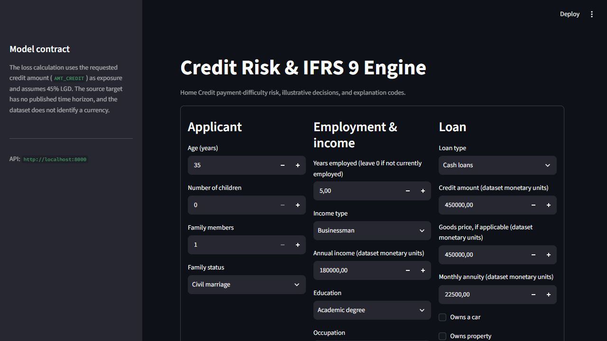
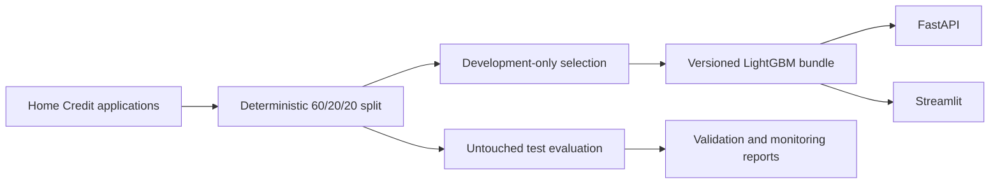

# Credit Risk and IFRS 9 Demonstrator

A working credit-application risk service, built on the Home Credit competition data, with a deliberately separate IFRS 9 ECL mechanics example.

[Live dashboard](https://credit-risk-ifrs9-engine.streamlit.app) · [API documentation](https://credit-risk-api-92it.onrender.com/docs) · [Model card](reports/model_card.md) · [Validation report](reports/validation_report.md)

## Result at a glance

The deployed LightGBM model improved test AUC from **0.6563 to 0.6774** against a logistic-regression baseline using the same 15 inputs and data split. The gain is modest but consistent across the other ranking and probability metrics. I would treat it as evidence that non-linear relationships add value here, not as proof that the model is ready for lending decisions.

| Metric | Logistic baseline | LightGBM |
|---|---:|---:|
| AUC | 0.6563 | 0.6774 |
| Gini | 0.3127 | 0.3547 |
| KS | 0.2319 | 0.2611 |
| Brier score | 0.0723 | 0.0716 |
| PR-AUC | 0.1444 | 0.1612 |
| Log loss | 0.2691 | 0.2652 |

The published operating threshold is an illustrative break-even calculation, not a tuned lending policy. On the untouched 61,503-row test fold it approves 89.25% of applications and captures 25.86% of observed payment-difficulty events among declined cases. The [threshold analysis](reports/threshold_analysis.md) shows how that trade-off changes at two other fixed operating points.



## What the application does

The Streamlit dashboard sends 15 applicant-provided fields to a FastAPI service. The service returns a payment-difficulty risk score, an illustrative approve/decline outcome, local SHAP reason codes, and a simple loss calculation based on the requested credit amount and an assumed 45% LGD. If the hosted API is unavailable, the dashboard can score with the same versioned model bundle locally.

The public contract excludes gender, credit-bureau scores, regional population density, employer type and car age. The model was fitted on that exact public feature set; the service does not quietly replace unavailable bureau data with missing values.



The main engineering and modelling choices are intentional:

- The training and serving schemas match. Persisted categorical levels prevent training/serving drift.
- Challenger selection uses development-only out-of-fold predictions. The test fold is not used to choose a model or threshold.
- Gender is absent from the model and API, but retained offline for group diagnostics. The observed approval-rate gap is reported in percentage points with a bootstrap interval; it is not presented as a causal or legal fairness finding.
- SHAP reason codes explain model behaviour. They are not causal findings or production adverse-action notices.
- The fitted bundle is committed and baked into both Docker images, so a clean checkout can run without redistributing the Kaggle data.

The [decisions log](DECISIONS.md) records rejected approaches and trade-offs. Supporting evidence includes the [model comparison](reports/model_comparison.md), [fairness audit](reports/fairness_audit.md), [monitoring demonstration](reports/monitoring_demo.md), and [consolidated validation report](reports/validation_report.md).

## Run it locally

The quickest route does not retrain the model and does not require the Kaggle dataset:

```powershell
git clone https://github.com/Aakashanil67/credit-risk-ifrs9-engine.git
cd credit-risk-ifrs9-engine
docker compose up --build
```

Open `http://localhost:8501` for the dashboard or `http://localhost:8000/docs` for the API. Stop the stack with `docker compose down`.

For a Python 3.12 environment, full model rebuild, report regeneration and test commands, follow [the reproduction guide](docs/reproduction.md). Raw Home Credit files are deliberately excluded from Git.

## IFRS 9 scope

The model estimates the dataset's binary payment-difficulty outcome. The dataset does not publish a 12-month default horizon, so the score is not labelled as a 12-month PD.

The separate [ECL mechanics report](reports/ifrs9_summary.md) demonstrates Stage 1, Stage 2 and Stage 3 calculations with assumed PD term structures and survival-weighted monthly default hazards. It applies discount factors to stated upside, base and downside scenarios. Its worked Stage 1 example reconciles month by month to **1,796.08 dataset monetary units**. It shows the mechanics; it is not an accounting provision or a substitute for portfolio-specific estimates and governance across PD, LGD, EAD and staging.

## Limits

Home Credit is historical competition data, not a South African lending portfolio. There is no out-of-time validation, local affordability policy, observed recovery history, contractual amortisation schedule or live outcome feed. Monetary amounts are therefore described as dataset monetary units. The monitoring runs are controlled replays and stresses, not production observations. A real deployment would still require local data and independent validation, followed by formal review from legal and policy owners. Security controls, outcome monitoring and model governance would also need to be established.

The hosted services use free tiers and may take a short time to wake after inactivity.

## Project context

This is a rebuild of a credit-risk project I previously completed manually. I used coding assistants during the rebuild for implementation and review. The modelling decisions, tests, failed approaches and limitations are documented so the work can be assessed on the evidence rather than on an implied claim of unaided coding.
