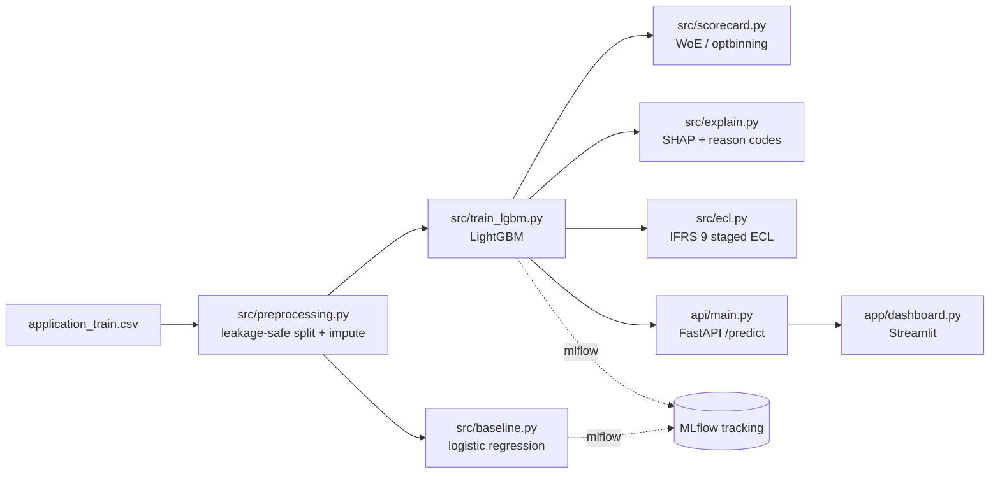

# credit-risk-ifrs9-engine

PD model, IFRS 9 expected-credit-loss calculator, and SHAP-explained credit scorecard on the Home Credit dataset, served through a FastAPI endpoint and a Streamlit dashboard.

Framed as if deployed at a South African lender under SARB model-risk expectations — see `reports/model_card.md` once that lands.

## Architecture

## Status

This is a work in progress, built module by module. The results table, scorecard sample, reason-code example, IFRS 9 example, and run instructions land here once each piece is real — this README gets rewritten once the pipeline runs end to end, not padded with placeholders now.
