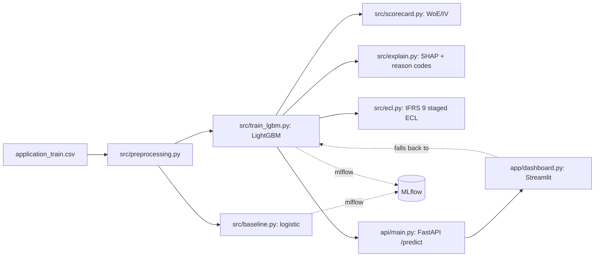

# credit-risk-ifrs9-engine

[](https://github.com/Aakashanil67/credit-risk-ifrs9-engine/actions/workflows/ci.yml)


A probability-of-default model on 307,511 real Home Credit loan applications, with a WoE credit
scorecard, SHAP reason codes, and an IFRS 9 staged ECL calculator, shipped as a FastAPI service
and a Streamlit decision dashboard.

Not deployed to a public URL yet: see [Status](#status). Everything below runs locally or via
Docker Compose.

## The problem

8.1% of applicants in this dataset defaulted. A model that predicts "repaid" for every single
applicant scores 91.9% accuracy while catching zero of the defaults a lender actually cares
about. The obvious metric is actively misleading here, which is why every result below is
reported as AUC, Gini and KS instead. Most portfolio projects stop at reporting one of those
numbers; the harder and more useful problem is turning a score into a rand amount to provision
and a sentence a credit committee can read out loud, which is what the scorecard, SHAP layer and
IFRS 9 calculator below are for.

## Results

Validation set (61,502 applications), LightGBM against a logistic regression baseline:

| metric | logistic baseline | LightGBM |
|---|---|---|
| AUC | 0.7326 | 0.7565 |
| Gini | 0.4652 | 0.5129 |
| KS | 0.3466 | 0.3794 |
| Brier score | n/a | 0.0678 |

LightGBM wins on every ranking metric, and its calibration curve tracks the diagonal closely
across the 0-30% PD range it actually sees (`reports/figures/calibration_curve.png`). The raw PD
values are usable as probabilities rather than only a ranking, which matters because the ECL
calculator multiplies them directly.

**Scorecard: information value by feature** (`reports/scorecard.md`, full points table included):

| feature | IV | read |
|---|---|---|
| EXT_SOURCE_3 | 0.329 | strong |
| EXT_SOURCE_2 | 0.322 | strong |
| EXT_SOURCE_1 | 0.146 | medium |
| years_employed | 0.117 | medium |
| age_years | 0.087 | weak |

**Reason codes**: real output for a scored applicant, `SK_ID_CURR=419561`, PD=0.666:

> - Low external credit bureau score (source 3) raises the estimated default risk.
> - Low external credit bureau score (source 2) raises the estimated default risk.
> - Low price of the goods being financed raises the estimated default risk.

**IFRS 9 provisioning** (`reports/ifrs9_summary.md`, validation portfolio, LGD 45%):

| stage | loans | ECL | coverage |
|---|---|---|---|
| 1 (performing) | 58,854 | R1,121,206,522 | 3.210% |
| 2 (SICR, lifetime ECL) | 2,494 | R183,421,016 | 10.504% |
| 3 (credit-impaired) | 154 | R23,690,333 | 32.023% |

Coverage rises monotonically with stage, which is the sanity check that actually matters here:
riskier loans get provisioned at a higher rate, not a flat one.

**Fairness check** (`reports/model_card.md`): mean predicted PD tracks actual default rate
closely within both genders (the model is calibrated, not biased in that narrow sense), but a
gender-driven default-rate gap in the training data produces a 15.7-point approval-rate gap at an
illustrative cutoff (72.6% F vs 56.9% M). Flagged as the item most likely to block a real
compliance sign-off, not glossed over.

## Architecture



The dashboard calls the API first; if it's unreachable it scores directly against the saved model
artifacts instead (`api/scoring.py`, shared by both), so it doesn't depend on the API being up to
demo the dashboard standalone.

## How to run it

```bash
python -m venv .venv && .venv\Scripts\activate   # .venv/bin/activate on Mac/Linux
pip install -r requirements.txt
```

Get `application_train.csv` from Kaggle's [Home Credit Default Risk](https://www.kaggle.com/competitions/home-credit-default-risk)
competition (requires a free Kaggle account and phone-verified access to the competition data),
drop it in `data/`.

```bash
python -m src.train_lgbm          # trains + saves models/lgbm_model.joblib and friends
python -m src.scorecard           # optional: WoE scorecard + reports/scorecard.md
python -m src.explain             # optional: SHAP figures + calibration curve
python -m src.ecl                 # optional: portfolio ECL summary

uvicorn api.main:app --reload     # API at http://localhost:8000/docs
streamlit run app/dashboard.py    # dashboard at http://localhost:8501
```

```bash
curl -X POST http://localhost:8000/predict -H "Content-Type: application/json" -d '{
  "age_years": 35, "years_employed": 5, "income_total": 180000,
  "credit_amount": 450000, "annuity": 22500, "gender": "F",
  "owns_car": true, "owns_realty": true, "num_children": 1,
  "family_members": 3, "education": "Higher education"
}'
```

Docker (needs `python -m src.train_lgbm` run once first, see [Status](#status)):

```bash
docker compose up --build
```

Tests: `pytest -v` (38 tests; 15 API tests skip automatically if `models/` isn't populated, since
there's no Kaggle data in CI). Lint: `ruff check . && ruff format --check .`. Pre-commit:
`pre-commit install`.

## Design decisions and trade-offs

- **LGD flat 45%, EAD = original credit amount, not amortised balance.** Neither is measured
  recovery data (this dataset doesn't have any), so both are stated assumptions, configurable in
  `src/config.py`, not fitted values dressed up as measurements.
- **IFRS 9 SICR staging compares two different models' PDs for the same applicant**, not one
  loan's PD over real time, because the Kaggle data is a single snapshot with no repeat
  observations. Documented as a proxy in `reports/ifrs9_summary.md`, not hidden.
- **`optbinning`'s `BinningProcess`/`Scorecard` orchestrator segfaults on this machine.** Root
  cause: a broken `ortools` CP-SAT overload plus an import-order sensitivity that cost real
  debugging time (see `CLAUDE.md`). Worked around by driving `OptimalBinning(solver="mip")`
  directly per feature and computing the PDO points table by hand instead of trusting the
  higher-level API.
- **Model artifacts aren't baked into the Docker images.** `models/` is gitignored and Kaggle's
  terms don't allow redistributing the training data, so there's nothing to build a model from
  inside a fresh image anyway; it's mounted read-only from the host at runtime instead.
- **Reason codes say "missing", never guess "low", for a NaN feature.** A new applicant has no
  bureau file yet; claiming their (unmeasured) score is low would be a false, specific claim about
  a real person's credit file, not a harmless approximation.

## Status

Built and tested locally end to end (dataset, model, scorecard, SHAP, ECL, API, dashboard), all
pushed with green CI, including a Docker build check that runs on every push. What's not done:

- **No public deployment.** Render/Streamlit Community Cloud need their own accounts and a manual
  deploy step this repo doesn't automate.
- **`docker compose up` is CI-validated (both images build clean on every push) but not run
  end-to-end locally**, since there's no Docker Desktop on the machine this was built on.
- **Gender is used as a direct model feature** (see the Fairness check under Results above).
  Removing it doesn't remove the disparity on its own, since income, occupation and region can
  reconstruct much of the same signal; this needs a real disparate-impact review before any
  production use, not a one-line fix.
- **No drift monitoring or scheduled retraining.** The model is a snapshot; a live deployment
  needs both.
- **Not South African data.** The SARB/NCA framing throughout (`reports/model_card.md`) is a
  deliberate exercise in "how would this be documented for a SA lender," not a claim about the
  underlying population; see the model card's Limitations section for the full list.
