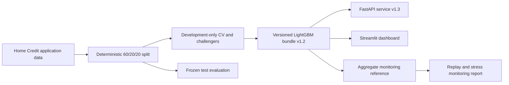

# Credit Risk & IFRS 9 Demonstrator

An end-to-end credit-risk modelling project built on Kaggle's Home Credit Default Risk data. It
trains a probability-of-default (PD) model, exposes a constrained public scoring contract through
FastAPI and Streamlit, returns SHAP-derived reason codes, and documents discounted,
scenario-weighted expected-credit-loss (ECL) mechanics.

Try the [dashboard](https://credit-risk-ifrs9-engine.streamlit.app) or inspect the
[API documentation](https://credit-risk-api-92it.onrender.com/docs). The Render service uses a
free instance and can take a short time to wake after inactivity.



## What is deployed

The public demo accepts 15 inputs an applicant can reasonably provide at application time: loan
terms, income, employment, household details, housing and car ownership, education, income type,
family status, and occupation. It excludes gender, credit-bureau variables, regional population
density, employer type, and car age. That matters: the public form and fitted model use the same
contract, rather than silently filling unavailable fields with missing values.

The trained LightGBM model was selected by five-fold cross-validation on the training fold. A
separate validation fold selected 193 trees through early stopping; the selected model was then
refit on the combined train and validation data. The 61,503-row test fold was held back until the
final evaluation.

| Metric | Logistic baseline | LightGBM |
|---|---:|---:|
| AUC | 0.6563 | 0.6774 |
| Gini | 0.3127 | 0.3547 |
| KS | 0.2319 | 0.2611 |
| Brier score | 0.0723 | 0.0716 |
| PR-AUC | 0.1444 | 0.1612 |
| Log loss | 0.2691 | 0.2652 |

Both models use the same 15 fields, development data, and untouched test fold. The comparison is
therefore a useful measure of the added value of the tree model, not a comparison between two
different data privileges. Full details are in [the model comparison](reports/model_comparison.md).

## Run locally

Use Python 3.12. Download `application_train.csv` from the
[Home Credit Default Risk competition](https://www.kaggle.com/competitions/home-credit-default-risk)
and place it in `data/`; the raw competition data is intentionally excluded from Git.

```powershell
python -m venv .venv
.\.venv\Scripts\Activate.ps1
pip install -r requirements.txt

python -m src.train_lgbm --profile public_demo
python -m src.explain --profile public_demo
python -m src.public_demo_audit
python -m src.ecl

uvicorn api.main:app --reload
streamlit run app/dashboard.py
```

### Reproduce the v1.3 lifecycle evidence

Run these commands after placing `application_train.csv` in `data/`. Challenger selection uses
only the train-plus-validation development rows. The audit uses the frozen test fold. Monitoring
replays a deterministic sample from the same historical data; it is not a production feed.

```powershell
python -m src.challenger_validation
python -m src.public_demo_audit
python -m src.monitoring_demo
python -m src.validation_report
python scripts/load_test.py --url http://localhost:8000 --requests 15 --concurrency 3
```

The first four commands update `reports/challenger_validation.*`,
`reports/public_demo_audit.json`, `reports/fairness_audit.md`, `reports/threshold_analysis.md`,
`models/public_demo/monitoring_reference.json`, `reports/monitoring_demo.*`, and
`reports/validation_report.md`. `validation_report` consumes the earlier generated JSON files.
The load command needs a running API but does not need the raw dataset; it prints aggregate timing
and status counts only.

The fitted `models/public_demo/` bundle is versioned so the services run from a clean checkout;
retraining requires the Kaggle data. For the containerised stack:

```powershell
docker compose up --build
```

The API is then available at `http://localhost:8000/docs` and the dashboard at
`http://localhost:8501`. Run `pytest -q` for tests and `ruff check .` plus
`ruff format --check .` for static checks.

## Scope and limits

Home Credit is a historical competition dataset, not a South African lending portfolio. It has no
contractual amortisation schedules, observed recoveries, account-level risk migration, local
pricing, or production outcome-monitoring feed. Amounts are consequently described as **dataset
monetary units** rather than a named currency. The API's loss figure is a simple illustrative
12-month `PD × LGD × EAD` calculation; it is not an IFRS 9 provision.

The separate [ECL mechanics report](reports/ifrs9_summary.md) shows Stage 1, Stage 2, and Stage 3
examples using survival-weighted monthly default hazards, discounting, and stated upside/base/
downside scenarios. It is deliberately a mechanics demonstration, not a synthetic portfolio
provision.

The dashboard's approve/decline label comes from exposed illustrative economics, not a lender's
policy. The threshold, fairness diagnostic, test-fold operating view, model limitations, and
engineering choices are documented in the [model card](reports/model_card.md),
[fairness audit](reports/fairness_audit.md), [threshold analysis](reports/threshold_analysis.md),
and [decisions log](DECISIONS.md).

## Model lifecycle evidence

The v1.3 service release adds validation and observability controls without replacing the fitted
v1.2.0 LightGBM bundle. The development-only challenger study evaluated five candidates using
out-of-fold development predictions. No candidate passed every predeclared gate, so the incumbent
remains preferred and no model is promoted automatically.

The frozen test-fold diagnostics include 1,000 deterministic stratified bootstrap intervals in the
[public-demo audit](reports/public_demo_audit.json). The [monitoring demonstration](reports/monitoring_demo.md)
uses deterministic replay and controlled stress transformations against a versioned aggregate
reference. It is a reproducible simulation, not real production monitoring. The consolidated
[validation report](reports/validation_report.md) and [monitoring runbook](reports/monitoring_runbook.md)
summarise the evidence and the controls a real lender would still need.

The public endpoint accepts at most 20 prediction requests per IP address per minute. Monetary
inputs are bounded to the supported public contract: income up to 5,000,000, credit and goods
price up to 4,050,000, and annuity up to 300,000 dataset monetary units.
